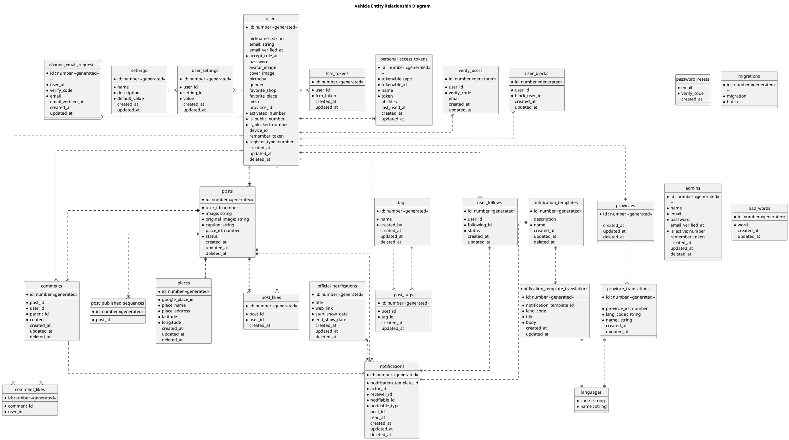

```plantuml
@startuml
hide circle
skinparam linetype ortho
title Vehicle Entity Relationship Diagram

entity "verify_users"{
  *id: number <<generated>>
  --
  *user_id
  *verify_code
  email
  created_at
  updated_at
}

entity "personal_access_tokens" {
	*id : number <<generated>>
  --
  *tokenable_type
  *tokenable_id
  *name
  *token
  abilities
  last_used_at
  created_at
  updated_at
}

entity "users" {
	*id: number <<generated>>
  --
  nickname : string
  email: string
  email_verified_at
  *accept_rule_at
  password
  avatar_image
  cover_image
  birthday
  gender
  favorite_shop
  favorite_place
  intro
  province_id
  *activated: number
  *is_public: number
  *is_blocked: number
  device_id
  remember_token
  *register_type: number
  created_at
  updated_at
  deleted_at
}

entity "comments" {
  *id: number <<generated>>
  --
  *post_id
  *user_id
  *parent_id
  *content
  created_at
  updated_at
  deleted_at
}

entity "comment_likes" {
  *id: number <<generated>>
  --
  *comment_id
  *user_id
}

entity "posts" {
  *id: number <<generated>>
  --
  *user_id: number
  *image: string
  *original_image: string
  *caption: string
  place_id: number
  *status
  created_at
  updated_at
  deleted_at
}

entity "places" {
  *id: number <<generated>>
  --
  *google_place_id
  *place_name
  *place_address
  *latitude
  *longitude
  created_at
  updated_at
  deleted_at
}

entity "tags" {
  *id: number <<generated>>
  --
  *name
  *created_by
  created_at
  updated_at
  deleted_at
}

entity "post_tags" {
  *id: number <<generated>>
  --
  *post_id
  *tag_id
  created_at
  updated_at
}

entity "provinces" {
	*id : number <<generated>>
  --
  created_at
  updated_at
  deleted_at
}

entity "province_translations" {
	*id : number <<generated>>
  --
	*province_id : number
	*lang_code : string
	*name : string
  created_at
  updated_at
}

entity "languages" {
	*code : string
	*name : string
}

entity "password_resets" {
	*email
  *verify_code
  created_at
}

entity "migrations" {
	*id : number <<generated>>
  --
  *migration
  *batch
}

entity "admins" {
	*id : number <<generated>>
  --
  *name
  *email
  *password
  email_verified_at
  *is_active: number
  remember_token
  created_at
  updated_at
  deleted_at
}

entity "change_email_requests" {
	*id : number <<generated>>
  --
  *user_id
  *verify_code
  *email
  email_verified_at
  created_at
  updated_at
}

entity "user_follows"{
  *id: number <<generated>>
  --
  *user_id
  *following_id
  *status
  created_at
  updated_at
}

entity "user_blocks"{
  *id: number <<generated>>
  --
  *user_id
  *block_user_id
  created_at
  updated_at
}

entity "settings"{
  *id: number <<generated>>
  --
  *name
  *description
  *default_value
  created_at
  updated_at
}

entity "user_settings"{
  *id: number <<generated>>
  --
  *user_id
  *setting_id
  *value
  created_at
  updated_at
}

entity "post_likes" {
  *id: number <<generated>>
  --
  *post_id
  *user_id
  created_at
}

entity "post_published_sequences" {
  *id: number <<generated>>
  --
  *post_id
}

entity "fcm_tokens" {
  *id: number <<generated>>
  --
  *user_id
  *fcm_token
  created_at
  updated_at
}

entity "official_notifications" {
  *id: number <<generated>>
  --
  *title
  *web_link
  *start_show_date
  *end_show_date
  created_at
  updated_at
  deleted_at
}

entity "notifications" {
  *id: number <<generated>>
  --
  *notification_template_id
  *actor_id
  *receiver_id
  *notifiable_id
  *notifiable_type
  post_id
  read_at
  created_at
  updated_at
  deleted_at
}

entity "notification_templates" {
  *id: number <<generated>>
  --
  description
  *name
  created_at
  updated_at
  deleted_at
}

entity "notification_template_translations" {
  *id: number <<generated>>
  --
  *notification_template_id
  *lang_code
  *title
  *body
  created_at
  updated_at
}

entity "bad_words" {
  *id: number <<generated>>
  --
  *word
  created_at
  updated_at
}

provinces ||..|{ province_translations
users ||..right..|{ user_follows
users ||..right..|{ user_blocks
users ||..left..|{ user_settings
settings ||..right..|{ user_settings
users ||..|{ posts
users ||..|{ post_likes
users ||..|{ comment_likes
users ||..right..|{ verify_users
users ||..|| provinces
users ||..|{ comments
users ||..left..|{ change_email_requests
users ||..right..|{ personal_access_tokens
posts ||..|| places
posts ||..|{ post_tags
posts ||..|{ post_likes
posts ||..|{ post_published_sequences
comments ||..|{ comment_likes
posts ||..|{ comments
tags ||..|{ post_tags
province_translations ||..|| languages
users ||..right..|{ fcm_tokens
users ||..|{ notifications
notification_templates ||..|{ notifications
notification_templates ||..|{ notification_template_translations
notification_template_translations ||..|| languages
official_notifications ||..|{ notifications
posts ||..|{ notifications
comments ||..|{ notifications
user_follows ||..|{ notifications
@enduml
```
